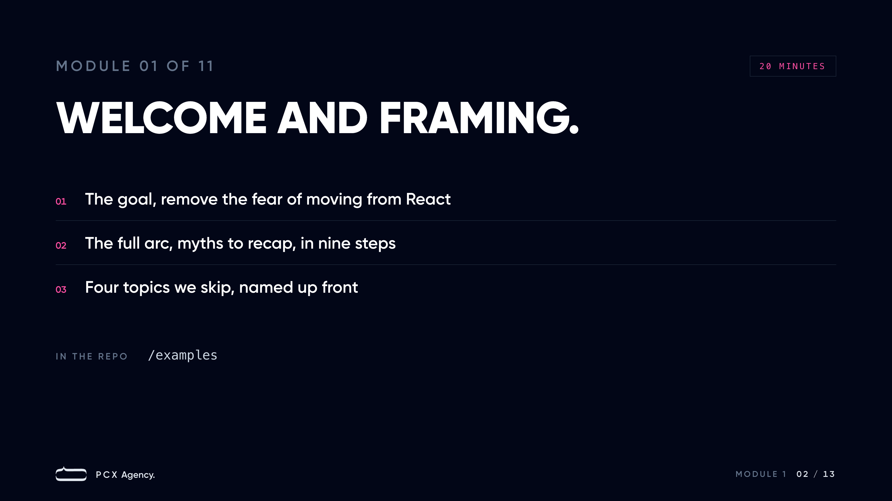
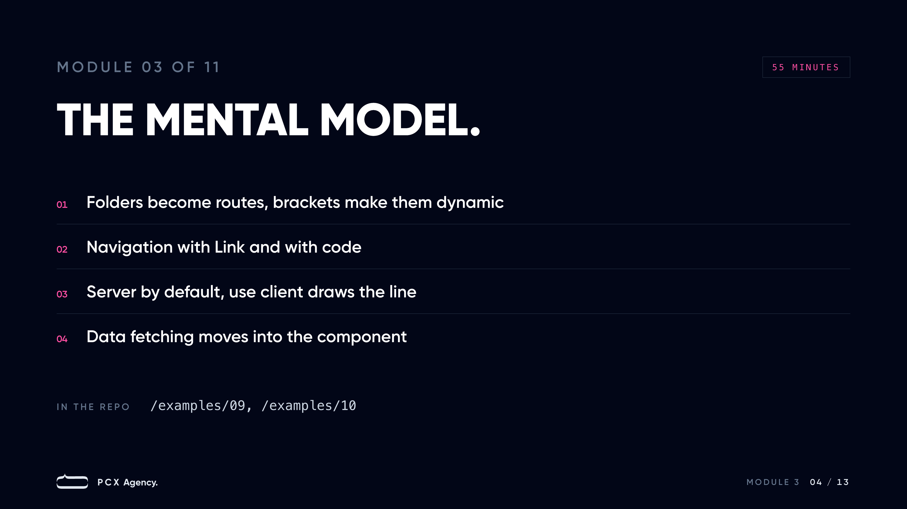

<!-- REVIEWED - 06 -->

# Introduction to Next.js


Welcome. My name is Shawqi Hatem, and this is a full workshop on Next.js. I built it for you. You know React. You have not moved to Next.js yet, or you moved and you still feel unsure about what runs where. My goal is simple. Remove the fear of moving from React to Next.js by building the right mental model, not by covering everything.

Three things carry this workshop. You get every word of this in writing, so nothing depends on your notes. You get a slide for each module. And you get a repo with a runnable example for every idea we cover, one route per idea.

## How this workshop runs

Every module has a time budget, a goal, and a reference list at the end so you can check me. Everything I claim comes from official documentation. In those lists T1 means the official docs, nextjs.org, react.dev, and nodejs.org. T2 means MDN. T3 means a vendor page, and I use one only where the vendor is the only source. I checked every claim against the live pages on 2026-07-25, with Next.js at 16.2.12 and React at 19.2.8.

## Schedule

| Module                                            | Minutes |
| ------------------------------------------------- | ------- |
| Module 1: Welcome and framing                     | 20      |
| Module 2: Why Next.js and the myths               | 25      |
| Module 3: From React to Next.js, the mental model | 55      |
| Module 4: Rendering patterns                      | 65      |
| Module 5: Guardrails, errors and not found        | 25      |
| Module 6: Mutations with Server Functions         | 55      |
| Module 7: State and providers                     | 30      |
| Module 8: Polish, metadata to env                 | 35      |
| Module 9: Traditional servers and serverless      | 40      |
| Module 10: Hands-on recap                         | 45      |
| Module 11: What comes next                        | 20      |

That is 415 minutes of content. We run it in two hour sessions, with a short break inside each one. Four sessions is the tight cut. Five sessions is the comfortable one, and the extra time goes to your questions and the exercises. If a session runs long, we take the time from module 10. Rendering and mutations keep their full time.

| Sessions | The split                                                        |
| -------- | ---------------------------------------------------------------- |
| Four     | 1 to 3, then 4 and 5, then 6 to 8, then 9 to 11                  |
| Five     | 1 to 3, then 4 and 5, then 6 and 7, then 8 and 9, then 10 and 11 |

## Module 1: Welcome and framing (20 minutes)



### Module 1 goal

By the end of this module you know what this workshop is and what it is not. Its job is to get you from React to Next.js without fear. It is not a complete course, and I name plainly which parts we leave out.

### How to follow along

You need three things.

- Node.js 20.9 or newer. This is the floor Next.js itself sets. The installation docs state "Minimum Node.js version: 20.9".
- pnpm. This repo uses it for install and scripts.
- An editor you are comfortable in.

This repo is a lean Next.js 16 teaching build of my [shawqi-stack](https://github.com/shawqicauses/shawqi-stack) template. It lives at <https://github.com/shawqicauses/next-one-day-introduction-for-react-developers>.

Clone it, install, and start the dev server.

```bash
git clone https://github.com/shawqicauses/next-one-day-introduction-for-react-developers
cd next-one-day-introduction-for-react-developers
pnpm install
pnpm dev
```

You will type. Every lab runs in this repo. You can also just watch. You get every step in writing, so you can replay everything on your own.

### In the repo

Open the repo in your editor and start the dev server. We start at `/examples`. It is a numbered nav, one link per example, 01 to 15, in the order we follow. The nav lives in `src/app/(app)/examples/layout.tsx`. This index is home base. We come back here in every module.

### Why an introduction

This workshop is not enough to master Next.js. We will not pretend otherwise. It is an introduction, and its one job is to remove the fear of moving from React to Next.js.

That fear usually comes from a missing mental model, not from missing years of practice. A few focused sessions are enough to build the model and to practice the daily tool kit around it. You leave knowing what Next.js is, what it is not, how it thinks, where your React knowledge fits, and what to reach for when you hit the common walls. You do not leave an expert. Nobody does after an introduction.

So we make a trade. We go deep on the model, we practice it right away, and we stay honest about what we skip. Next I name every topic we skip, so you never have to guess whether a gap is yours or ours.

### What we cover and what we skip

We cover one arc, start to finish.

1. Why Next.js exists, and the four myths that scare React developers away.
2. The mental model for moving from React to Next.js.
3. Rendering patterns, and when each one earns its place.
4. The guardrails. Errors, 404s, and loading states.
5. Mutations. Forms and Server Functions doing real writes.
6. State. What moves to the server and what stays client state.
7. Polish. Metadata, images, and fonts.
8. Traditional servers and serverless, and what that choice changes.
9. A hands-on recap that breaks the examples on purpose and fixes them.

We skip four things. I name each one so you know it exists.

- Authentication. Real apps need it, and we do not build it here.
- Testing. Out of scope for this workshop.
- Deployment pipelines. We explain hosting models, we do not wire up a pipeline.
- Deep caching. We teach everyday revalidation and skip the cacheComponents model.

We close with where to go for all four.

### Module 1 references

- T1 Next.js installation requirements: <https://nextjs.org/docs/app/getting-started/installation>
- T1 Next.js current major version: <https://nextjs.org/>

## Module 2: Why Next.js and the myths (25 minutes)


### Module 2 goal

By the end of this module you can explain why React itself points you toward a framework. You can also answer the four myths that stop React developers from trying Next.js, and every answer is backed by an official docs quote, not by folklore.

### What React is and what it leaves open

React is a UI library. It gives you components, and components are the whole offer. Routing is not included. Data fetching is not included. Rendering infrastructure is not included. That is not a criticism. It is React's own framing.

The React docs carry a page called "Build a React app from Scratch". It walks through routing, data fetching, and code-splitting as problems you must solve yourself. It warns that "the way you develop routing, data-fetching, and other features will be unique to your situation", which makes help harder to find. Its own deep dive is blunt about where this ends: "going this route is often the same as building your own adhoc framework". That spelling is theirs, not a typo.

The rendering line is even more direct: "if in the future your app needs support for server-side rendering (SSR), static site generation (SSG), and/or React Server Components (RSC), you will have to implement those on your own".

So the real choice is not framework or no framework. The choice is adopting a framework or slowly writing your own.

### React itself tells you to use a framework

This advice does not come from Vercel. It comes from react.dev. The page "Creating a React App" opens with a recommendation: "If you want to build a new app or website with React, we recommend starting with a framework."

The page then lists full-stack frameworks, and Next.js is first in that list. React describes it like this: "Next.js's App Router is a React framework that takes full advantage of React's architecture to enable full-stack React apps."

Read the wording again. Full-stack React apps. That is React talking, not marketing. React also explains why frameworks are the recommendation: "The frameworks we recommend have built-in solutions for these problems." The problems in question are routing, data fetching, and common usage patterns. Exactly the gaps I just named.

### Myth one: Next.js is only an SEO fix

The official definition does not mention SEO at all: "Next.js is a React framework for building full-stack web applications." The same page adds "It also automatically configures lower-level tools like bundlers and compilers." Build tooling has nothing to do with search rankings.

Now look at the Getting Started section of the docs. Its description reads "Learn how to create full-stack web applications with the Next.js App Router." Its core feature index has 18 topics, and routing, data fetching, caching, mutating data, and deploying are five of them, with metadata one more among the rest.

SEO support is real and first class. The metadata page says "The Metadata APIs can be used to define your application metadata for improved SEO and web shareability". But metadata is one topic of 18. If SEO is all you see, you are looking at one feature and ignoring the rest of the framework.

### Myth two: Next.js is a front-end framework

Four features in the docs say otherwise. Each one runs on the server.

Start with route handlers. A route file is a server endpoint, and the docs say so plainly. "Route Handlers allow you to create custom request handlers for a given route using the Web Request and Response APIs." It answers GET, POST, PUT, PATCH, DELETE, HEAD, and OPTIONS.

Next, Server Functions. "A Server Function is an asynchronous function that runs on the server. You can call them from the client through a network request". Your client code calls a function. The body runs on the server.

Then the proxy file. It runs your code on the server before a request is completed. If you have seen Next.js code before, you may know this file by its old name. The docs state "The middleware file convention is deprecated and has been renamed to proxy."

And Server Components. "By default, layouts and pages are Server Components, which lets you fetch data and render parts of your UI on the server". One listed benefit matters most here. "Use API keys, tokens, and other secrets without exposing them to the client".

A front-end framework can't keep a secret, because everything it has ships to the browser. Next.js keeps secrets on the server. The docs call it exactly what it is, "a React framework for building full-stack web applications".

### Myth three: Next.js replaces React

Next.js is built on React, not built to replace it. The homepage tagline is "The React Framework for the Web", and the same page says "Next.js is built on the latest React features, including Server Components and Actions."

The docs draw the split in one sentence: "You use React Components to build user interfaces, and Next.js for additional features and optimizations." React stays your UI language. Next.js adds the infrastructure around it.

The docs even assume you arrive knowing React. The Getting Started prerequisites read: "Before getting started, it'll help if you're comfortable with: HTML, CSS, JavaScript, React". Hooks, state, and event handlers appear in the docs as plain React, linked back to react.dev.

Components, props, hooks, and JSX all carry over. Your React knowledge is the foundation this workshop builds on. It is not a sunk cost.

### Myth four: you need Vercel

Vercel builds Next.js. You still do not need Vercel to run it, and the strongest quote comes from react.dev, not from Vercel. React's docs say: "You can deploy a Next.js app to any hosting provider that supports Node.js or Docker containers, or to your own server." The next line adds: "Next.js also supports static export which doesn't require a server."

The Next.js deploying docs match: "Next.js can be deployed as a Node.js server, Docker container, static export, or adapted to run on different platforms." On the Node option the docs are explicit. "Next.js can be deployed to any provider that supports Node.js", and "This server supports all Next.js features."

The support table on that page marks the Node.js server and the Docker container as supporting all features. Static export supports a limited set and runs on hosts like AWS S3, Nginx, or Apache. Vercel appears there as one of two verified adapters, alongside Bun. An adapter option is not a requirement.

### Module 2 references

- T1 React, Creating a React App: <https://react.dev/learn/creating-a-react-app>
- T1 React, Build a React app from Scratch: <https://react.dev/learn/build-a-react-app-from-scratch>
- T1 Next.js docs landing page: <https://nextjs.org/docs>
- T1 Next.js homepage: <https://nextjs.org/>
- T1 Next.js Getting Started index: <https://nextjs.org/docs/app/getting-started>
- T1 Next.js metadata and OG images: <https://nextjs.org/docs/app/getting-started/metadata-and-og-images>
- T1 Next.js route handlers file convention: <https://nextjs.org/docs/app/api-reference/file-conventions/route>
- T1 Next.js mutating data: <https://nextjs.org/docs/app/getting-started/mutating-data>
- T1 Next.js proxy file convention: <https://nextjs.org/docs/app/api-reference/file-conventions/proxy>
- T1 Next.js server and client components: <https://nextjs.org/docs/app/getting-started/server-and-client-components>
- T1 Next.js deploying: <https://nextjs.org/docs/app/getting-started/deploying>

## Module 3: From React to Next.js, the mental model (55 minutes)



### Module 3 goal

By the end of this module you can explain what changes when your React SPA becomes a Next.js app, and what stays the same. Four ideas do the work. Folders become routes. Layouts wrap pages. Navigation stays client-side. Components run on the server unless you say otherwise. Nothing here asks you to unlearn React.

### The SPA you already know

Start from your current world. A classic React SPA is one `index.html` file and one JavaScript bundle. The server returns the same nearly empty page for every URL. The browser downloads the bundle, React mounts, and from then on everything happens on the client. A router library reads the URL and swaps components. Your components fetch data from the browser, usually in effects or through a data library. State lives in the tab.

This model is not wrong. It gives you instant transitions and an app-like feel, and it is the baseline for everything that follows. Hold on to it. Next.js keeps the parts of it you like.

### Folders become routes

First shift. You delete the router config. The file system is the router.

The docs say it directly: "Next.js uses file-system based routing, meaning you can use folders and files to define routes." Folders map to URL segments. Files provide the UI. In the docs' words, "Folders are used to define the route segments that map to URL segments," and files like `page` and `layout` "create UI that is shown for a segment." Nesting folders nests segments.

```text
app/
  layout.tsx        wraps everything below
  page.tsx          serves /
  blog/
    page.tsx        serves /blog
    [slug]/
      page.tsx      serves /blog/my-post, one file for every post
```

One rule keeps you safe. A folder becomes a public route only when it holds a `page` or `route` file. The project structure docs state that a route is "not publicly accessible" until a `page.js` or `route.js` file is added to the segment. So you can colocate components, helpers, and tests inside `app` without creating accidental pages.

The `[slug]` folder in the tree is a dynamic segment. We look at it next.

You already think in component trees. The route tree is now a folder tree you can read in your editor.

### Dynamic segments in practice

Most real routes have a variable part. A blog has one page per post. A shop has one page per product. In your SPA you wrote a route pattern like `/blog/:slug` and read it with `useParams`. In Next.js the pattern is a folder name.

Square brackets make the segment dynamic. Wrapping a folder name in square brackets, like `[slug]`, "creates a dynamic route segment which is used to generate multiple pages from data." One `app/blog/[slug]/page.tsx` file serves every post.

The page reads the value through the `params` prop, and version 16 changed its shape. The release notes list the old synchronous access under removals and give the replacement: "Must use async: `await params`". So `params` arrives as a Promise, and you await it.

```tsx
// app/blog/[slug]/page.tsx
export default async function BlogPostPage({
  params,
}: {
  params: Promise<{ slug: string }>;
}) {
  const { slug } = await params;
  return <h1>{slug}</h1>;
}
```

The Next.js 13 and 14 snippets you will find online read `params.slug` without the await. They break on 16. The await is the fix.

Two more things before we move on. When you can list the slugs ahead of time, `generateStaticParams` pre-renders one page per slug at build time. And when the slug matches nothing, you call `notFound()` and hand the request to the 404 path, which Module 5 covers in full.

### Layouts wrap pages

A page is the UI for one route. The docs define it as "UI that is rendered on a specific route." A layout is UI shared across several routes. In your SPA you built this yourself, a shell component around the router outlet, and you took care that it did not remount on navigation. Next.js turns that pattern into a file convention.

Put a `layout.tsx` in a folder and it wraps every page below it. The docs give layouts a strong guarantee: "On navigation, layouts preserve state, remain interactive, and do not rerender." Your sidebar keeps its scroll position. Your search box keeps its text. The persistent shell you hand-built comes for free.

One layout is special. The root layout replaces your `index.html`. The docs are firm here: "The root layout is required and must contain `html` and `body` tags." Your document skeleton is now a React component. If you forget the file, the dev server creates it for you.

```tsx
// app/layout.tsx
export default function RootLayout({ children }: PropsWithChildren) {
  return (
    <html lang="en">
      <body>{children}</body>
    </html>
  );
}
```

### Navigation still feels like a SPA

Here is the fear. Server rendering sounds like full page reloads on every click. It is not.

In Next.js, "routes are rendered on the server by default." Navigation still runs through the `Link` component from `next/link`, which "extends the HTML `<a>` tag to provide prefetching and client-side navigation." It renders a real anchor tag, and it is "the primary way to navigate between routes in Next.js."

Two mechanisms preserve the SPA feel:

- Prefetching. "Prefetching is the process of loading a route in the background before the user navigates to it." Next.js prefetches routes linked with `Link` automatically when the links enter the viewport. By the time your user clicks, much of the next page is already there.
- Client-side transitions. The docs describe the old alternative first: a full page load "clears state, resets scroll position, and blocks interactivity." Next.js skips that. It updates the content in place and keeps shared layouts mounted.

The docs land on the same conclusion I want you to take from this hour. Client-side transitions are what make a server-rendered app feel like a client-rendered app. You move rendering to the server and give up nothing about how navigation feels.

### Navigate with code

`Link` covers clicks on things you can see. Some navigation starts in code instead. The classic case: a form saves, and then you send the user to the new page.

That job belongs to `useRouter` from `next/navigation`. "The `useRouter` hook allows you to programmatically change routes inside Client Components." Its `push` method performs "a client-side navigation to the provided route" and "Adds a new entry into the browser's history stack."

```tsx
"use client";

import { useRouter } from "next/navigation";

export function SaveButton() {
  const router = useRouter();

  async function save() {
    await saveDraft();
    router.push("/drafts");
  }

  return <button onClick={save}>Save</button>;
}
```

Do not reach for it by default. The docs keep the priority straight: "Use the `<Link>` component for navigation unless you have a specific requirement for using `useRouter`."

Two sibling hooks read the URL. "`usePathname` is a Client Component hook that lets you read the current URL's pathname." And "`useSearchParams` is a Client Component hook that lets you read the current URL's query string." Server pages do not need the hook. For fetching by query the docs say "it's often a better option to read the `searchParams` prop of the corresponding Page."

The server side has its own one-liner. "The `redirect` function allows you to redirect the user to another URL", and it works "while rendering in Server and Client Components, Route Handlers, and Server Functions". A page that finds no team calls `redirect('/login')` and rendering stops there. Module 6 uses it after mutations.

If you come from React Router, the map is short. `useNavigate` becomes `useRouter`. `useParams` became the awaited `params` prop from the last section. `useSearchParams` keeps its name.

### Components run on the server by default

Now the biggest shift. In the App Router, "layouts and pages are Server Components" by default. A Server Component renders on the server, and its code never ships to the browser.

Two consequences matter:

- Less JavaScript for the client. The glossary states that Server Components "don't add to the client JavaScript bundle," and the docs list reducing "the amount of JavaScript sent to the browser" among the reasons to use them. Markup-heavy parts of your app can cost the browser almost nothing.
- Direct access to server resources. Server Components "can fetch data directly." You can read your database inside the component and "Use API keys, tokens, and other secrets without exposing them to the client." No API route hop just to reach your own data.

The trade is real but small. Server Components "can't use state or browser APIs." No `useState`, no `onClick`, no `window`. So where does your interactive code go?

### The use client boundary

Behind one directive. You write `'use client'` at the top of a file, "before any imports." The docs add a calming note: "This is a React feature," not Next.js magic.

Do not read the directive as a per-component label. The docs are precise. It declares "a boundary between the Server and Client module graphs (trees)." One line splits your app into two worlds. Files above the boundary can run on the server. Files below it are client code, the kind you write today.

The boundary is sticky. Once a file carries the directive, "all of its imports and the components it directly renders are included in the client bundle." That has a convenient flip side. In the docs' words, "you don't need to add the directive to every component that is intended for the client." Mark the entry file. Its imports follow.

When do you reach for it? The docs' own list is your daily work: state and event handlers like `onClick` and `onChange`, life-cycle logic like `useEffect`, browser-only APIs like `localStorage` and `window`, and custom hooks. Your `useState` and `useEffect` code lives happily behind this boundary, unchanged.

```tsx
"use client";

import { useState } from "react";

export function Counter() {
  const [count, setCount] = useState(0);
  return <button onClick={() => setCount(count + 1)}>Count: {count}</button>;
}
```

One composition rule closes the loop. "You can pass Server Components as a prop to a Client Component," most often as `children`. Those children are rendered on the server and passed "as rendered output," so they never join the client bundle. A client-side modal can wrap a server-rendered cart. Interactive shell outside, server work inside.

### Data fetching moves into the component

In a SPA you render first, then fetch in an effect, then render again. In a Server Component the order flips. The docs give the whole pattern in one sentence: "turn your component into an asynchronous function, and await the `fetch` call."

```tsx
export default async function Page() {
  const posts = await getPosts();
  return <PostList posts={posts} />;
}
```

No effect. No loading flag for server data. The component waits for its own data, and the HTML leaves the server already filled.

Two facts make this bigger than syntax. First, you are not limited to `fetch`. Server Components accept "any asynchronous I/O", and because they render on the server, "credentials and query logic will not be included in the client bundle", so a database query through an ORM or a database client is safe right inside the component. Second, identical `fetch` requests in one render "are memoized by default, so you can fetch data in the component that needs it instead of drilling props."

Client Components still fetch when they must. For that side the docs point to React's `use` API or a community library like SWR or React Query. The default home for data, though, is now the server. Module 4 covers what happens to freshness and caching from there.

### What carries over unchanged

Almost everything you own. The docs define the relationship in one line: "Next.js is a React framework for building full-stack web applications. You use React Components to build user interfaces, and Next.js for additional features and optimizations." Components are still the unit of UI. JSX is still your markup. Props still flow down. Hooks still run in your client components, exactly as react.dev teaches them. Your component design habits and your debugging instincts transfer as they are. Next.js wraps around your React knowledge. It does not replace it.

### Where Next.js 16 stands

You are learning this on Next.js 16, released in October 2025. Turbopack "has reached stability for both development and production builds" and is the default bundler for new projects. Caching became "entirely opt-in" through the new Cache Components model, and `proxy.ts` replaces `middleware.ts`. Node.js 18 is no longer supported, the minimum is now 20.9. The App Router includes the React 19.2 features, delivered through its built-in React canary release.

### In the repo (8 minutes)

1. Visit `/examples/10-dynamic-route` and follow the two known slugs. The URL slug changes while one `[slug]` folder serves every page.
2. Click the third link, the slug that does not exist. The 404 path takes over. Module 5 shows the file behind it.
3. Open `src/app/(app)/examples/10-dynamic-route/[slug]/page.tsx`. The `const { slug } = await params` line is the Next.js 16 shape. Pasted 13 or 14 snippets break without it.
4. Visit `/examples/09-data-fetching` and view the page source. The list sits in the raw HTML. Open `src/app/(app)/examples/09-data-fetching/page.tsx`. The async component awaits `getPosts`. No effect and no loading flag.

### Module 3 references

- T1 Next.js docs overview: <https://nextjs.org/docs>
- T1 Installation: <https://nextjs.org/docs/app/getting-started/installation>
- T1 Project structure: <https://nextjs.org/docs/app/getting-started/project-structure>
- T1 Layouts and pages: <https://nextjs.org/docs/app/getting-started/layouts-and-pages>
- T1 Linking and navigating: <https://nextjs.org/docs/app/getting-started/linking-and-navigating>
- T1 useRouter: <https://nextjs.org/docs/app/api-reference/functions/use-router>
- T1 usePathname: <https://nextjs.org/docs/app/api-reference/functions/use-pathname>
- T1 useSearchParams: <https://nextjs.org/docs/app/api-reference/functions/use-search-params>
- T1 redirect: <https://nextjs.org/docs/app/api-reference/functions/redirect>
- T1 Server and Client Components: <https://nextjs.org/docs/app/getting-started/server-and-client-components>
- T1 The use client directive: <https://nextjs.org/docs/app/api-reference/directives/use-client>
- T1 Fetching data: <https://nextjs.org/docs/app/getting-started/fetching-data>
- T1 Next.js glossary: <https://nextjs.org/docs/app/glossary>
- T1 Next.js 16 release post: <https://nextjs.org/blog/next-16>
- T1 React Quick Start: <https://react.dev/learn>

## Module 4: Rendering patterns (65 minutes)


### Module 4 goal

By the end of this hour you can answer one question for any route you build. You will know the five rendering patterns, what opts a route into each one, and how to read the build output. You will pick a pattern on purpose instead of getting one by accident.

### The only question that matters

Every rendering pattern is an answer to the same question. Where does the HTML come from, and when is it made.

Some routes make HTML at build time. Some make it on the server for every request. Some make it in the browser. Some make it once and refresh it in the background. Some send it in pieces. That is the whole hour. Five answers to one question.

Your starting point matters too. The docs open with it: "By default, layouts and pages are Server Components, which lets you fetch data and render parts of your UI on the server". So the framework's default posture is server-made HTML. Every other pattern is a choice you make on top of that.

Why start on the server at all. The docs give plain reasons. You can "Use API keys, tokens, and other secrets without exposing them to the client." You can fetch data close to the source. And you "Reduce the amount of JavaScript sent to the browser". Keep those three in mind as we walk the patterns.

### Client-side rendering

This is the pattern you already know from plain React. The browser gets minimal HTML. It downloads JavaScript. It renders the UI. Then it fetches data. The user watches a spinner while all of that happens.

When it is right: dashboards, logged-in tools, and screens where the data is personal and search engines do not matter.

In Next.js this is a `"use client"` page that fetches in an effect. The docs are precise about where the directive goes: "You can create a Client Component by adding the `"use client"` directive at the top of the file, above your imports."

```tsx
"use client";

import { useEffect, useState } from "react";

export default function Dashboard() {
  const [stats, setStats] = useState(null);

  useEffect(() => {
    fetch("/api/stats")
      .then((response) => response.json())
      .then(setStats);
  }, []);

  if (!stats) return <p>Loading...</p>;
  return <StatsPanel stats={stats} />;
}
```

Know what the directive really does. Per the docs, `"use client"` "is used to declare a boundary between the Server and Client module graphs (trees)." Everything the file imports joins the client bundle. You do not repeat the directive on every child.

One honest nuance. On first load Next.js still sends HTML for this page: "HTML is used to immediately show a fast non-interactive preview of the route to the user." The client-side part is the data. It arrives only after JavaScript runs your effect in the browser. On later navigation(s) the docs say "Client Components are rendered entirely on the client, without the server-rendered HTML."

### Static rendering

Static rendering means the HTML is made before anyone asks for it. The v16 glossary folds the old name into a new one. Its static rendering entry just says "See Pre-rendering." So say pre-rendering and you match the current docs.

The glossary defines pre-rendering as "When a component is rendered at build time or in the background during revalidation." The result "is HTML and RSC Payload, which can be cached and served from a CDN."

Build time itself has a glossary entry too: "During build time, Next.js transforms your code into optimized files for production, generates static pages, and prepares assets for deployment."

This is the fast path. The work happened before the request. Every visitor gets the same HTML, straight from cache. Nobody waits for rendering.

It is also the default. The glossary again: "Pre-rendering is the default for components that don't use Request-time APIs." Do nothing special and you are static. This page pre-renders because it never touches the request:

```tsx
export default async function PricingPage() {
  const response = await fetch("https://cms.example.com/plans");
  const plans = await response.json();

  return <PlanList plans={plans} />;
}
```

Run `next build` and read the route list. The legend on the CLI reference marks these routes with a circle:

> ○ (Static) pre-rendered as static content

### Dynamic rendering

Dynamic rendering makes the HTML per request. The glossary: "When a component is rendered at request time rather than build time. A component becomes dynamic when it uses Request-time APIs."

What opts you in. The glossary lists the request-time APIs as `cookies()`, `headers()`, `searchParams`, and `draftMode()`. Touch request data and you are dynamic. The scope is bigger than you might expect. The migration guide states: "Without Cache Components, reading cookies(), headers(), or searchParams opts the whole route into dynamic rendering." One cookie read at the top of the page and the entire route renders per request.

The trade is simple. The HTML is always fresh and can be personal. But every visitor pays the render wait, every time.

In the build output these routes carry the function symbol:

> ƒ (Dynamic) server-rendered on demand

The CLI page's sample output shows both symbols in one list, with routes like `○ /_not-found` and `ƒ /products/[id]`. Reading that list after every build is the fastest rendering audit you have.

### Revalidation

The middle ground. Static HTML that refreshes. The ISR guide promises you can "Update static content without rebuilding the entire site". The glossary adds that in Next.js ISR is also known as revalidation.

First, the v16 truth. Old tutorials will tell you Next.js caches every fetch. That is gone. The current guide opens with: "By default, fetch requests are not cached." Caching is something you opt into: "You can cache individual requests by setting the cache option to 'force-cache'." If you learned Next 13 or 14, unlearn cached-by-default fetch today.

Time-based refresh. "Use the next.revalidate option on fetch to revalidate data after a specified number of seconds".

```tsx
const response = await fetch("https://cms.example.com/plans", {
  next: { revalidate: 60 },
});
```

The mechanics are stale-while-revalidate, and the ISR guide spells them out. With a 60 second interval, "After 60 seconds has passed, the next request will still return the cached (now stale) page" and "The cache is invalidated and a new version of the page begins generating in the background". Visitors never wait. Someone just gets slightly old HTML once.

On-demand refresh works through tags. You tag a fetch with `next: { tags: ["user"] }`. The newer `cacheTag` function does the same job, but it needs the cacheComponents flag from the end of this module. On the invalidation side sits `revalidateTag`, which runs in Server Actions and Route Handlers. In v16 it takes a second argument: "The second argument sets how long stale content can be served while fresh content generates in the background." Here is their own example:

```tsx
revalidateTag("user", "max"); // Recommended: stale-while-revalidate
```

Read your own writes. When the user saves something and must see it immediately, use `updateTag` instead. It "immediately expires cached data for read-your-own-writes scenarios" and works in Server Actions only. Pick `revalidateTag` for freshness that can wait a beat. Pick `updateTag` when the user is staring at their own edit.

### Streaming

Dynamic rendering has a weak spot. The streaming guide names it: "A single slow database query or API call can block the entire page." Streaming is the fix: "Streaming changes this by using chunked transfer encoding to send parts of the response as they become ready."

The cheap version is a file. Put `loading.tsx` next to `page.tsx` and "Next.js automatically wraps the page content in a `<Suspense>` boundary, using your loading component as the fallback." The whole page streams behind one fallback.

The precise version is your own boundaries. Wrap slow components in `<Suspense>` yourself. Per the guide, "Each `<Suspense>` boundary is an independent streaming point." Boundaries resolve on their own and do not block each other.

```tsx
import { Fragment, Suspense } from "react";

export default function PageDashboard() {
  return (
    <Fragment>
      <Header />
      <Suspense fallback={<ChartSkeleton />}>
        <RevenueChart />
      </Suspense>
      <Suspense fallback={<TableSkeleton />}>
        <OrdersTable />
      </Suspense>
    </Fragment>
  );
}
```

What arrives first is the shell. "Everything that renders before any async work resolves is called the static shell". It "is sent immediately, giving the user something to see and interact with while dynamic content streams in." Header, navigation, and layout land at once. The slow chart streams in when its data resolves.

One gotcha for later. "You cannot change the status code or headers after streaming starts." A `notFound()` thrown mid-stream cannot become a real 404. Next.js injects a noindex meta tag instead.

### The RSC payload and hydration

So what actually crosses the wire. For Server Components it is not always HTML. The docs put it like this. "The RSC Payload is a compact binary representation of the rendered React Server Components tree." The docs list what it contains:

- "The rendered result of Server Components"
- "Placeholders for where Client Components should be rendered and references to their JavaScript files"
- "Any props passed from a Server Component to a Client Component"

On first load the payload arrives embedded in the HTML stream. On client-side navigation there is no HTML at all. The streaming guide: "only the component payload is fetched (with an rsc: 1 request header) and no HTML is transferred at all". Open the network tab during a navigation and you will see it.

Hydration is the Client Component side of the story. The Next.js definition: "Hydration is React's process for attaching event handlers to the DOM, to make the static HTML interactive." React's own reference for `hydrateRoot` says it "lets you display React components inside a browser DOM node whose HTML content was previously generated by react-dom/server." The same page puts it in one line: "Hydration turns the initial HTML snapshot from the server into a fully interactive app that runs in the browser."

Keep the split straight. Server Components ship their result, not their code. The glossary says they "render on the server, can fetch data directly" and add nothing to the client JavaScript bundle. Only Client Components hydrate.

### When hydration goes wrong

Hydration has one hard requirement. React's reference says "hydrateRoot() expects the rendered content to be identical with the server-rendered content." Your component renders twice, once on the server and once in the browser, and the two results must match. When they differ you get the hydration mismatch, the error most React developers meet in their first Next.js week.

React is explicit about the stakes. "React recovers from some hydration errors, but you must fix them like other bugs." At best a mismatch costs speed. At worst "event handlers can get attached to the wrong elements". The docs leave no wiggle room: "You should treat mismatches as bugs and fix them."

Three classic causes, all with the same root. The component renders a value the server and the browser can't agree on.

- Time and locale. `Date.now()` or `new Date().toLocaleString()`. The server renders one moment, the browser renders another.
- Random values. `Math.random()` or a generated id. Two renders, two numbers.
- Browser-only branches. React names this one directly: "Using checks like `typeof window !== 'undefined'` in your rendering logic." The server takes one branch, the browser takes the other.

Two exits, and you pick by ownership.

- Make the client value state. Render a stable placeholder on the server, set the real value in an effect after mount. The first client render matches the server, and the update happens after hydration.
- Make the server value the source of truth. Compute the timestamp or the id on the server, pass it down as a prop, and render the same value in both places.

For the rare value that can never match, React offers `suppressHydrationWarning`. Its own caveat: "This only works one level deep, and is intended to be an escape hatch. Don't overuse it."

### Reading the matrix

Here is the table I want you to keep. Read each row as an answer to our one question.

| Pattern      | When HTML is made            | Who waits              | Freshness     |
| ------------ | ---------------------------- | ---------------------- | ------------- |
| Client-side  | In the browser               | The user, every visit  | Every fetch   |
| Static       | At build time                | Nobody at request time | Until rebuild |
| Dynamic      | On the server, per request   | The user, each request | Each request  |
| Revalidation | Build, then refresh          | Nobody, stale serves   | The interval  |
| Streaming    | Shell first, then boundaries | Split per boundary     | Mixed         |

### Where it is heading

What follows is the road ahead. You do not need it today.

Next.js 16 ships an opt-in flag: "To enable the cacheComponents flag, set it to true in your next.config.ts file". With it on, "cacheComponents implements Partial Pre-rendering (PPR) as the default behavior in the App Router". The old experimental PPR flags "are no longer necessary and have been removed", so do not go looking for them. Under this model "Data fetching is dynamic by default, and you choose what to cache at the page, component, or function level." The tool for that choice is a directive: "The use cache directive allows you to mark a route, React component, or a function as cacheable." The philosophy guide sums up where this lands: "the boundary between static and dynamic is at the component level, not the route level." Know it exists so the current docs make sense to you.

### In the repo (8 minutes)

1. Run `pnpm build`. A circle sits beside `/examples/03-static-rendering` in the route list.
2. Open `src/app/(app)/examples/03-static-rendering/page.tsx`. Add an awaited `headers()` read, borrowed from example `02-server-rendering`. Build again. The circle flips to the function symbol.
3. Remove the read and build once more. The circle comes back. Static or dynamic follows from what the code reads, not from a setting.
4. Run `pnpm start`. Visit `/examples/04-revalidation`. Wait thirty seconds and refresh twice. Stale serves first, fresh second. The reason is `export const revalidate = 30` in its `page.tsx`.
5. Run `pnpm dev` again. Visit `/examples/05-streaming`. Three stages arrive in order. `loading.tsx` holds the route for the first moment, the shell replaces it, and the slow part lands after two seconds. The route file is the cheap boundary, the `Suspense` fallback in `page.tsx` is the precise one. This route awaits `connection()`, so the stream also shows in the production build from step 4.

### Module 4 references

- T1 Server and Client Components: <https://nextjs.org/docs/app/getting-started/server-and-client-components>
- T1 Next.js glossary: <https://nextjs.org/docs/app/glossary>
- T1 next CLI build output: <https://nextjs.org/docs/app/api-reference/cli/next>
- T1 Caching without Cache Components: <https://nextjs.org/docs/app/guides/caching-without-cache-components>
- T1 Incremental Static Regeneration: <https://nextjs.org/docs/app/guides/incremental-static-regeneration>
- T1 Revalidating: <https://nextjs.org/docs/app/getting-started/revalidating>
- T1 Streaming: <https://nextjs.org/docs/app/guides/streaming>
- T1 Migrating to Cache Components: <https://nextjs.org/docs/app/guides/migrating-to-cache-components>
- T1 cacheComponents config: <https://nextjs.org/docs/app/api-reference/config/next-config-js/cacheComponents>
- T1 use cache directive: <https://nextjs.org/docs/app/api-reference/directives/use-cache>
- T1 Rendering philosophy: <https://nextjs.org/docs/app/guides/rendering-philosophy>
- T1 hydrateRoot: <https://react.dev/reference/react-dom/client/hydrateRoot>

## Module 5: Guardrails, errors and not found (25 minutes)


### Module 5 goal

By the end of this module every route you build has guardrails. You know which file catches a throw, which file answers a missing record, and how both sit next to the loading file from module 4.

### error.tsx catches what throws

The docs split failures "into two categories: expected errors and uncaught exceptions." Expected ones, like a rejected form value, you "model expected errors as return values". This module is about the other kind. "Next.js uses error boundaries to handle uncaught exceptions."

The boundary is a file. Drop an `error.tsx` next to a page, and "error.js wraps a route segment and its nested children in a React Error Boundary." When something below throws during rendering, your component "shows as the fallback UI." One requirement: every docs example opens with the same comment, "Error boundaries must be Client Components".

```tsx
"use client"; // Error boundaries must be Client Components

export default function ErrorBoundary({
  error,
  unstable_retry,
}: {
  error: Error & { digest?: string };
  unstable_retry: () => void;
}) {
  return <button onClick={() => unstable_retry()}>Try again</button>;
}
```

Two props arrive. `error` is "An instance of an Error object". Server errors come scrubbed and "show a generic message with an identifier". That identifier is `error.digest`, a hash you match against server-side logs. `unstable_retry` is the recovery. When called, "the function will try to re-fetch and re-render the error boundary's children." Older tutorials destructure `reset` instead. That older prop re-renders without re-fetching, and the docs now say "In most cases, you should use unstable_retry() instead."

Know the edges. The file "does not wrap the layout.js or template.js above it in the same segment." A root layout crash needs `global-error.tsx`, which "must define its own `<html>` and `<body>` tags" since it replaces the root layout when active.

### notFound and not-found.tsx

Errors are the unplanned path. Missing records deserve a planned one. The tool is a function. Import `notFound` from `next/navigation` and call it, as in `if (!post) notFound()`. Invoking it "throws a `NEXT_HTTP_ERROR_FALLBACK;404` error and terminates rendering of the route segment in which it was thrown." Nothing after the call runs.

What renders instead is the sibling file. "The not-found file is used to render UI when the notFound function is thrown within a route segment." The root copy does double duty. The root `app/not-found.tsx` handles "any unmatched URLs for your whole application".

Two details for the SEO minded. Next.js will also "inject a `<meta name="robots" content="noindex" />` tag". And "Next.js will return a 200 HTTP status code for streamed responses, and 404 for non-streamed responses". That is the module 4 streaming gotcha. Once the stream starts the status is sent, and the noindex tag covers SEO.

### The segment trio

You now hold all three segment files, and they rhyme.

- `loading.tsx` is the waiting path. "loading.js wraps not-found.js, page.js, and nested layout.js files in a `<Suspense>` boundary."
- `error.tsx` is the failure path, the same segment wrapped in a React error boundary.
- `not-found.tsx` is the missing path, for a thrown `notFound()` and, at the root, for every unmatched URL.

Module 4 used `loading.tsx` as its cheap streaming fallback. Same file.

### In the repo (5 minutes)

1. Visit `/examples/11-error-not-found` and click the first link. It re-renders the page with `?boom=1`, the render throws, and the boundary UI appears.
2. Click the Try again button. It calls `unstable_retry()`, which re-fetches and re-renders the segment. The URL still carries `?boom=1`, so the throw repeats. Remove the query and the page recovers.
3. Open `src/app/(app)/examples/11-error-not-found/error.tsx`. The `"use client"` line sits on top, the `unstable_retry` prop beside `error`.
4. Click the second link, `/examples/11-error-not-found/missing`. The `notFound()` call in `missing/page.tsx` throws and `not-found.tsx` renders in its place.
5. Open the network tab. The status is 404. Open the page source. The noindex meta tag is there.

### Module 5 references

- T1 Error handling: <https://nextjs.org/docs/app/getting-started/error-handling>
- T1 error.js file convention: <https://nextjs.org/docs/app/api-reference/file-conventions/error>
- T1 notFound function: <https://nextjs.org/docs/app/api-reference/functions/not-found>
- T1 not-found.js file convention: <https://nextjs.org/docs/app/api-reference/file-conventions/not-found>
- T1 loading.js file convention: <https://nextjs.org/docs/app/api-reference/file-conventions/loading>

## Module 6: Mutations with Server Functions (55 minutes)


### Module 6 goal

By the end of this module you can change data without hand-writing a POST endpoint. You know what a Server Function is, how a form invokes one, how to show pending and errors, and what to call after the write.

### Reads are half the story

Modules 3 to 5 taught you to read. You fetched data, picked rendering patterns, added guardrails. Every route shows data. Real apps write it.

So your SPA instinct asks the right question. Where did my POST endpoint go? It still exists. Next.js now writes it for you. "Behind the scenes, actions use the POST method, and only this HTTP method can invoke them." You write a function. The framework builds the endpoint around it.

### Server Functions and the use server directive

First, the name, because it changed. react.dev dates the rename to September 2024. Before that, everything was a Server Action. Now: "A Server Action is a Server Function used in a specific way (for handling form submissions and mutations). Server Function is the broader term."

The definition is one sentence. "A Server Function is an asynchronous function that runs on the server." The client calls it over the network, so it must be async. You mark one with use client's sibling: "The use server directive designates a function or file to be executed on the server side." Top of an async function body, or top of a whole file.

```ts
// app/actions.ts
"use server";

export async function createPost(formData: FormData) {
  await savePost(formData.get("title"));
}
```

The network hop sets the rules. "'use server' can only be used on async functions", and arguments "will need to be serializable". And one more rule. "It's not possible to define Server Functions in Client Components." Define them in a file like this one and import them anywhere.

### Forms without ceremony

You rarely call the function yourself. You hand it to a form. "React extends the HTML form element to allow a Server Function to be invoked with the HTML action prop."

```tsx
import { createPost } from "@/app/actions";

export default function NewPostPage() {
  return (
    <form action={createPost}>
      <input name="title" />
      <button>Create</button>
    </form>
  );
}
```

No onSubmit. No preventDefault. No fetch call. "When invoked in a form, the function automatically receives the FormData object", and you read it with the native FormData methods, like the `formData.get` call above.

The progressive enhancement promise has two halves. Keep them apart.

- Server Component forms work before React arrives: "forms that call Server Actions will be submitted even if JavaScript hasn't loaded yet or is disabled".
- Client Component forms hold the submit instead: "forms invoking Server Actions will queue submissions if JavaScript isn't loaded yet, and will be prioritized for hydration". Once hydrated, "the browser does not refresh on form submission."

### Pending and errors with useActionState

The form gives no feedback yet. The docs put it plainly. "turn the component that defines the form into a Client Component and use React useActionState."

```tsx
"use client";

import { useActionState } from "react";
import { createPost } from "@/app/actions";

export function NewPostForm() {
  const [state, formAction, pending] = useActionState(createPost, null);
  return (
    <form action={formAction}>
      <input name="title" />
      <button disabled={pending}>Create</button>
      <p aria-live="polite">{state?.message}</p>
    </form>
  );
}
```

The Next.js guides name the triple `[state, formAction, pending]`. The react.dev reference names the exact same triple `[state, dispatchAction, isPending]`. Same hook, same order, new labels.

`state` holds whatever the action returned last, so return messages and field errors as plain objects. `pending` is "a pending boolean that can be used to show a loading indicator or disable the submit button".

One catch. "When using useActionState, the Server function signature will change to receive a new prevState or initialState parameter as its first argument." Form data moves second: `createPost(prevState, formData)`.

For child components there is `useFormStatus` from react-dom. It "gives you status information of the last form submission", with its own pending flag. Its rule is strict. It "must be called from a component that is rendered inside a form", never one rendered in the same component. So their example puts a separate SubmitButton inside the form.

### After the write

Your write landed. The pages showing that data do not know yet. Four tools close the gap, all inside the action, and one response can carry "both the updated UI and new data in a single server round trip".

`refresh()` covers the current view. "refresh allows you to refresh the client router from within a Server Action." Use it when the view depends on state outside the cache. It "does not revalidate tagged data."

`revalidatePath` aims at one route. It lets you "invalidate cached data on-demand for a specific path". Use it when one route is affected and tagging is overkill.

`revalidateTag` refreshes every read behind a tag. In v16 it takes a second argument, since "The single-argument form revalidateTag(tag) is deprecated". The profile 'max' means stale-while-revalidate: "Users receive stale content while fresh data loads in the background." Fine for blogs and catalogs. It "intentionally skips that immediate re-render".

`updateTag` is for read-your-own-writes, when users must see their own change now. It "immediately expires the cached data for the specified tag", and the next request waits for fresh data instead of stale. Its scope: "updateTag can only be called from within Server Actions."

To move the user afterward, call `redirect`. It throws: "Invoking the redirect() function throws a NEXT_REDIRECT error", so it "should be called outside the try block when using try/catch statements". And "Any code after it won't execute", so revalidate first, redirect last. The docs' example calls revalidatePath('/posts'), then redirect('/posts').

### The security model in five points

1. Actions answer POST, and "only this HTTP method can invoke them".
2. "The request's Origin is compared to the Host (or X-Forwarded-Host). Mismatches are rejected."
3. "Action requests are capped at 1MB by default."
4. Clients reference actions by "encrypted, non-deterministic IDs".
5. None of that checks who is calling. "Always verify authentication and authorization inside every Server Function", and validate every argument, because arguments "are fully client-controlled".

### In the repo (8 minutes)

1. Visit `/examples/12-mutations` and submit an item. No route handler and no fetch call exist anywhere on this page.
2. Submit the empty form once. An error line appears under the form. The failure came back as a return value, not a throw.
3. Open `src/app/(app)/examples/12-mutations/item-form.tsx`. The `[state, formAction, pending]` triple and the disabled button carry the client half.
4. Open `src/app/(app)/examples/12-mutations/actions.ts`. `"use server"` sits on top, the `prevState` first argument follows, and the `revalidatePath("/examples/12-mutations")` call lands after the write.
5. Open `src/app/(app)/examples/12-mutations/store.ts`. The list lives in a module-level array. Restart the dev server, reload, the list is empty. Module 9 starts right there.

### Module 6 references

- T1 Mutating data: <https://nextjs.org/docs/app/getting-started/mutating-data>
- T1 use server: <https://nextjs.org/docs/app/api-reference/directives/use-server>
- T1 Server Functions: <https://react.dev/reference/rsc/server-functions>
- T1 use server on react.dev: <https://react.dev/reference/rsc/use-server>
- T1 useActionState: <https://react.dev/reference/react/useActionState>
- T1 useFormStatus: <https://react.dev/reference/react-dom/hooks/useFormStatus>
- T1 Forms guide: <https://nextjs.org/docs/app/guides/forms>
- T1 Server Actions guide: <https://nextjs.org/docs/app/guides/server-actions>
- T1 Data security guide: <https://nextjs.org/docs/app/guides/data-security>
- T1 revalidatePath: <https://nextjs.org/docs/app/api-reference/functions/revalidatePath>
- T1 revalidateTag: <https://nextjs.org/docs/app/api-reference/functions/revalidateTag>
- T1 updateTag: <https://nextjs.org/docs/app/api-reference/functions/updateTag>
- T1 refresh: <https://nextjs.org/docs/app/api-reference/functions/refresh>
- T1 redirect: <https://nextjs.org/docs/app/api-reference/functions/redirect>
